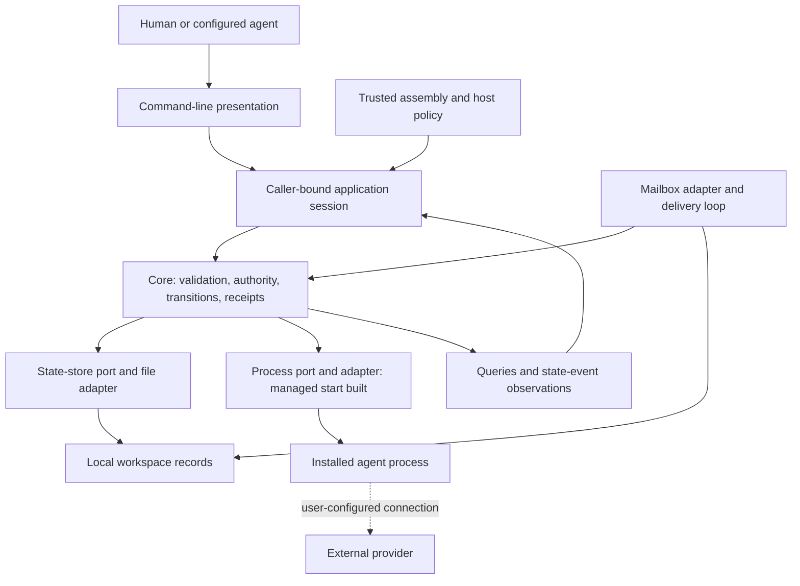

# System blueprint

2026-09-22 · Owner decision guide · Code baseline `eba4a60b668dcd8d4f9f51824a8e78f9f1fda1bb`.

Harnessing 101 is a local coordination record for an individual working with a few agent sessions. It records assignments, messages, blockers and human review. The accepted product is the command-line coordination cycle. Managed process execution is partly built; a successful launch is not proof that an installed agent participates. Delegated orchestration is a reviewed design **without construction approval or a date**.

This is a source review, not a new acceptance run. [Functional features](functional-features.md) separates each feature's implementation and acceptance. [Getting started](../GETTING-STARTED.md) covers commands; this document explains the decisions behind them.

## Evidence and status authority

These references are the authority for the status labels in both documents:

- **E1 — Accepted coordination baseline:** [product definition](../product/definition.md) and [Phase 2 exit ruling](../quality/h101-112-phase2-item2-discharge-ruling.md), with the [adapter-contract limits](../quality/h101-107-phase2-item3-ruling.md). Acceptance covers the recorded scope, not arbitrary agent compatibility.
- **E2 — Phase 3 requirements:** [exit criteria](../quality/phase3-exit-criteria.md), including H101-147, H101-153 and H101-158; [supervision architecture](h101-128-phase3-supervision.md), including its appended ordering clarification. These are obligations, not completion certificates.
- **E3 — Latest reported standing:** god's owner-request dispatch `god-2026-09-22-stanley-blueprint`, 2026-09-22, reports Kelly's position: item 1 is discharged **apart from D14**. This document records that report; it is not an independent Kelly verdict. The older H101-158 paragraph's missing D5/D18/D19/R3 findings describe `5cca4e0`, not the current code. Current code includes their fixes. The remaining real-tool evidence gap keeps the overall feature **BUILT NOT YET ACCEPTED**. D14's literal row concerns runner-produced rather than handwritten evidence; “D14 remains” is the reported tracking shorthand, not a rewrite of the row.
- **E4 — Hosting:** [H101-143](../quality/h101-143-phase3-item6-foundation-ruling.md) accepts the distinction between landed foundation and unsatisfied full item 6. The later mailbox tick exists in [assembly](../../internal/assembly/serve.go); Claudio's H101-155 completion/signoff memory reports orchestrator acceptance at `2b0c7af`. That acceptance is for the pump, not full supervision or item 6.
- **E5 — Unapproved orchestration:** [ADR 0006](../adr/0006-orchestrator-skill-and-delegated-session.md) and [H101-148 with H101-150 amendment](h101-148-agent-orchestrator-integration.md). The amendment supersedes workspace-wide delegated reads. A clean design review does not authorize implementation.

## Why the layers exist

The hexagonal design puts coordination rules behind interfaces, with command-line presentation, files and operating-system processes outside. It allows another interface to reuse the rules without becoming a second implementation of ownership, review or persistence. “Headless” means these rules work without a particular user interface.

**Core owns meaning:** registered references, allowed task transitions, human-review checks, message facts, request deduplication, profile/start checks and durable run/operation state. Budget policy and recovery policy also belong here by design, but are not yet complete features. Core must not decide by parsing terminal prose or holding process identifiers.

**Adapters own mechanisms:** file replacement and locking, mailbox envelopes, process launch, clocks, identifiers, transport and rendering. The trusted assembly opens the workspace, fixes caller/reviewer policy, supplies adapters and closes resources. Presentation receives the neutral [`FrontendSession`](../../internal/api/api.go), not the writable store or privileged host handle. [Boundaries](boundaries.md) defines four inbound roles—commands, queries, state events, run output—and six outbound roles—store, mailbox, process supervisor, output journal, clock, identifier source. Some roles remain design contracts rather than working surfaces.

## The workspace is the record, not the process

One resolved directory holds one workspace's state. Agent registration is an address and metadata record; it is not a live session. Task progress is reported coordination state; it is not inferred from CPU activity. A run records a managed execution attempt. An operation records the progress of an accepted command. These identities answer different questions and must remain separate.

The current [file store](../../internal/adapters/statestore/file.go) persists a snapshot and a caller/request-scoped receipt ledger in `state.json`. One operating-system lock admits one writer. A commit writes a temporary file, synchronizes it, replaces the state file and synchronizes the directory. Mailbox files and process effects do not share this transaction. Workspace revision counts committed state changes, including background delivery facts; it is not a productivity counter.

Successful command receipts identify a committed request, not task completion. A repeated identical request returns its recorded receipt; changing its payload conflicts. An uncertain write requires [request resolution](../adr/0004-uncertain-command-outcomes.md), not a fresh ID and blind retry. Managed start adds a second boundary: commit intent, operation and receipt; confirm a dispatch-attempted marker; invoke the process adapter; commit the observation. A crash after the marker can leave an unknown outcome even if no child was actually created. Recovery must not guess or duplicate the spawn.

## Commands, queries and the three kinds of history

Commands request changes; queries read detached records and consistent snapshots. The shipped CLI exposes selected point/list views; the application session has a broader query surface. `start-run`, `run` and `operation` now exist. An API declaration or state enumeration alone does not mean stop, recovery or output follow is implemented.

“Event journal” needs precision here:

| Record | Current behavior | What it does not establish |
| --- | --- | --- |
| Durable state and receipt ledger | Snapshot plus original receipt/event data for request replay | Not an append-only event-sourced database or general historical event-query service |
| State-event stream | [Bounded in-memory bus](../../internal/core/task/events.go) publishes committed changes; expired history requires a new snapshot | No durable stream continuation through a host restart; events are not stdout |
| Run output journal | [Designed separately](h101-128-phase3-supervision.md#output-and-failure-isolation--item-5) for channel-tagged bytes and resumable offsets | Real persisted output capture is not built; the journal package is a placeholder |

`serve` keeps the writer and sessions alive across client detach and now pumps the mailbox. File request/response transport supports later attaching clients without a network listener. This lifetime is the foundation for supervision, not evidence that live exit observation, tree stopping or recovery already works. [H101-143](../quality/h101-143-phase3-item6-foundation-ruling.md) preserves that distinction.

## Trust boundaries the owner should retain

- **Claims versus authority:** message sender fields and registered IDs are not authenticated authorship. Host-bound scope controls supported commands; ordinary differing sender/submitting identities remain distinct. Current CLI caller/reviewer configuration is a trusted local-user mechanism, not isolation from a hostile agent with the same operating-system account.
- **Approval versus confinement:** approving a profile permits a product-managed start. It does not validate earlier content, authenticate provider usage, restrict an independently launched process or prevent approved tools from sending accessible data externally.
- **Records versus prose:** acknowledgements are explicit receipt facts, results are attributed reports, and human acceptance is a separate decision. Instructions in messages or output cannot confer those privileges.
- **Filesystem versus security boundary:** locks and restricted application capabilities prevent supported-path mistakes. They do not defend against same-user modification of state or theft of transport session handles. H101-135 explicitly includes intake/response files in this exposure.

These limits come from [the threat model](../security/threat-model.md), [ADR 0002](../adr/0002-manual-agent-exposure-in-phases-1-2.md) and [the transport amendment](h101-128-phase3-supervision.md#h101-135--transport-rationale-and-exposure-scope-2026-09-21). Supported native targets are macOS arm64 and Linux amd64; Windows is excluded under [ADR 0001](../adr/0001-language-and-runtime.md).

## Open owner decision H101-163: participation protocol or Claude Code deferral

**Not decided; no implementation is authorized by this recommendation.** The owner wants installed-tool participation, not merely a surviving process.

The [Claude descriptor](../../scripts/agentic-cli-manifests/claude-code.json) expands to `claude -p '<json context>'`. At this baseline, the [runner](../../scripts/run-agentic-cli-cycle.py) prompt contains `workspace_id`, `task_id`, `agent_id`, `peer_id` and `run_id`. Separately, the supervisor writes a context file containing `schemaVersion`, `workspaceId`, `runId`, `agentId` and optional `taskId`/`peerAgentId`; the current runner does not pass a peer field into that product command. The owner's reported run had only the first five file fields and an empty mailbox. That observation comes from dispatch E3 and was not rerun for this document.

Neither payload explains where/how to query the assignment, follow the existing assigned-task lifecycle, read/acknowledge a message, contact the peer, or report an artifact. Identifiers alone are not a participation protocol. The invocation therefore supplies no specified route to the required cycle; spontaneous model inference would not be reliable compatibility evidence. The runner also currently ends successful starts as `started_no_participation`; it does not yet collect a successful authoritative cycle. Fixing the prompt alone would not close that evidence gap.

| Owner option | Benefit | Cost and limit |
| --- | --- | --- |
| **A. Specify and instruct a narrow worker participation protocol** | Tests the owner's actual installed-tool goal: the agent uses the existing coordination product and produces inspectable records | Define supported commands/file handoff, workspace location, assigned role, stable request IDs, retry behavior, peer exchange, blocker/rework/human-review boundaries, and result evidence. Then implement the selected invocation and runner observation; validate real authenticated execution per target. Instructions still cannot guarantee honest or correct model behavior. |
| **B. Record an explicit Claude Code owner deferral** | Uses the existing deferral mechanism, honestly bounding compatibility claims without more integration work now | No demonstrated Claude Code participation and no validation of the installed-tool benefit. A deferral is not successful compatibility and does not discharge other Phase 3 items. |

**Recommendation: A**, limited to an already-assigned worker and the existing human-review cycle, if demonstrating installed-tool usefulness is still the priority. Keep profile approval and human acceptance outside that worker's authority. This does not need or authorize ADR 0006's task-decomposing orchestrator, cross-worker process grants, `DelegatedSession` or new human-decision records. If that bounded trial is not worth the work now, choose B explicitly. Neither choice implies a schedule; the owner chooses, and Kelly applies the existing evidence gate.
