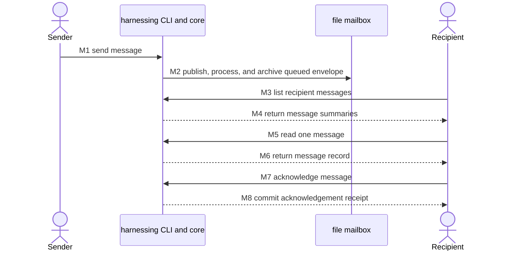
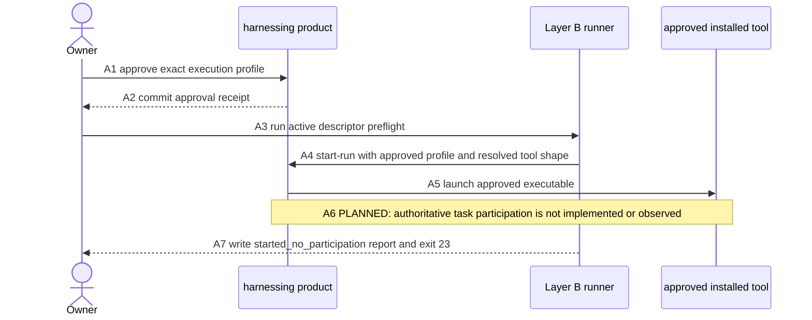
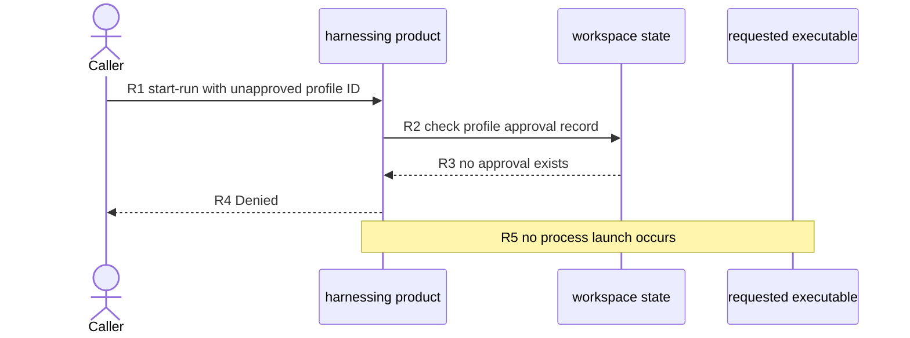
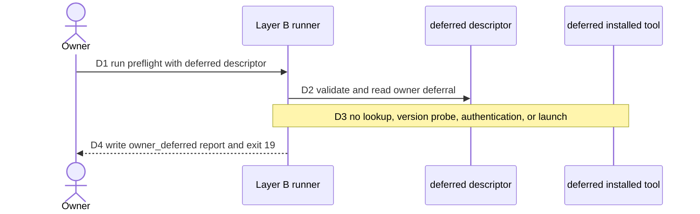
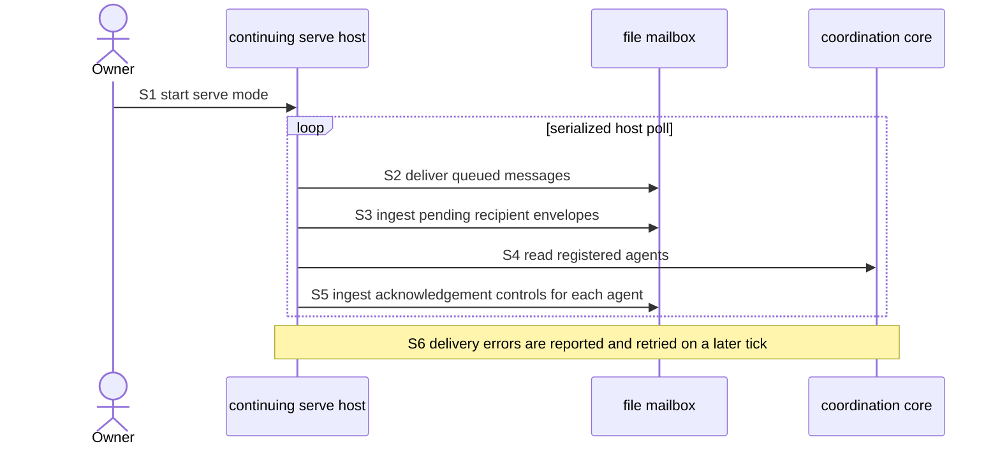

# Usage sequences

2026-09-22 · Command baseline `9d774b8`

These diagrams show the shipped command-line and runner paths without turning
process start into a participation claim. Command names and flags come from the
binary's `-h` output at the baseline above; runner flags come from
`scripts/run-agentic-cli-cycle.py --help`.

`EXISTS` means the named command or effect is present in that baseline. It does
not mean the whole feature is accepted. `PLANNED` means no shipped command
implements the step. Only numbered arrows and numbered notes are steps; other
notes state preconditions or boundaries.

Feature status comes from the [system blueprint](architecture/blueprint.md) and
the [functional-feature architecture](architecture/functional-features.md).

## 1. Core message loop

Messaging and explicit acknowledgement are **built and accepted** within the
limits in [Messaging and mailbox](architecture/functional-features.md#messaging-and-mailbox).
Sender fields remain unauthenticated claims, and acknowledgement does not prove
comprehension or completed work.

| Step | Status | Shipped command and flags | Meaning |
| --- | --- | --- | --- |
| M1 | EXISTS | `harnessing send -workspace <dir> -workspace-id <id> -caller <agent> -request-id <id> -message <id> -recipient <agent> -kind <Request\|Inform\|Result> -body <text> [-sender <agent>] [-task <id>] [-reply-to <id>] [-reviewer <id>]...` | Core validates and records the message as queued. |
| M2 | EXISTS | Automatic post-command effect of the same `send` invocation; no mailbox subcommand or extra flag exists. | The one-shot session calls the mailbox delivery pass. Delivery facts are separate from the send receipt. |
| M3 | EXISTS | `harnessing messages -workspace <dir> -workspace-id <id> -recipient <agent> [-reviewer <id>]...` | Reads the filtered message list. This query has no caller flag. |
| M4 | EXISTS | Result of the M3 `messages` command; no additional flag. | Returns recorded summaries; it does not acknowledge them. |
| M5 | EXISTS | `harnessing message -workspace <dir> -workspace-id <id> <messageID> [-reviewer <id>]...` | Reads one recorded message by positional identifier. |
| M6 | EXISTS | Result of the M5 `message` command; no additional flag. | Returns the detached message record. |
| M7 | EXISTS | `harnessing ack -workspace <dir> -workspace-id <id> -caller <recipient> -request-id <id> -message <id> [-reviewer <id>]...` | Only the recorded recipient may acknowledge the message through this command. |
| M8 | EXISTS | Receipt from the M7 `ack` command; no additional flag. | Records acknowledgement as a separate fact, not proof of understanding. |

## 2. Approved managed run: honest terminal result

Profile approval, managed start, and the descriptor runner are **built but not
yet accepted**. See [Profile approval](architecture/functional-features.md#profile-approval),
[Managed runs and supervision](architecture/functional-features.md#managed-runs-and-supervision),
and the [agentic command-line interface descriptor layer](architecture/functional-features.md#agentic-command-line-interface-descriptor-layer).
H101-163 remains an [open owner decision](architecture/blueprint.md#open-owner-decision-h101-163-participation-protocol-or-claude-code-deferral).

| Step | Status | Shipped command and flags | Meaning |
| --- | --- | --- | --- |
| A1 | EXISTS | `harnessing approve-profile -workspace <dir> -workspace-id <id> -reviewer <human> -caller <human> -request-id <id> -profile-id <id> -tool-executable <path> [-tool-argv-json <json>] [-working-dir <dir>] [-context-transport context-file]` | Records an immutable approved launch shape. Approval permits start; it is not confinement or authentication proof. |
| A2 | EXISTS | Receipt from the A1 `approve-profile` command; no additional flag. | Confirms the approval request committed. |
| A3 | EXISTS | `python3 scripts/run-agentic-cli-cycle.py --workspace-id <id> --task-id <id> --agent-id <id> --peer-id <id> --profile-id <id> --run-id <id> --product-revision <rev> --descriptor scripts/agentic-cli-manifests/claude-code.json --harnessing <path> --workspace <dir> --report <path>` | Runs the shipped evidence driver with its active Claude Code descriptor. Every shown runner flag is required. |
| A4 | EXISTS | The runner invokes `harnessing start-run -workspace <dir> -workspace-id <id> -run <id> -agent <id> -profile-id <id> -task <id> -tool-executable <resolved-path> -tool-argv-json <json>`. The CLI also supports optional `-caller`, `-request-id`, `-peer`, and repeatable `-reviewer`. | The product checks registration, caller scope, approval, and active-run rules before dispatch. |
| A5 | EXISTS | Effect of A4 `start-run`; executable and arguments must match the approved profile. | A surviving child can be recorded Running, but survival does not prove useful work. |
| A6 | PLANNED | No shipped participation command or flag. H101-163 must first choose and specify a narrow participation protocol or record deferral. | The current context identifiers do not tell the tool how to complete the coordination cycle. |
| A7 | EXISTS | Result of the A3 runner command; `--report <path>` selects the JSON report. | After a successful start receipt without authoritative cycle evidence, the runner returns `started_no_participation` and exit 23. It does not return `cycle_completed`. |

This is the shipped runner's honest success-path boundary, not a claim that a
real provider call will reach it in every environment. Authentication, network,
or product refusal can produce a different typed result earlier.

## 3. Refused start: no profile approval

The same built-but-unaccepted start gate refuses an unrecorded profile before
process launch. The authority and limitation are the [profile approval](architecture/functional-features.md#profile-approval)
and [managed-run](architecture/functional-features.md#managed-runs-and-supervision)
feature entries.

| Step | Status | Shipped command and flags | Meaning |
| --- | --- | --- | --- |
| R1 | EXISTS | `harnessing start-run -workspace <dir> -workspace-id <id> -caller <agent> -request-id <id> -run <id> -agent <agent> -profile-id <unapproved-id> [-task <id>] [-peer <agent>] [-tool-executable <path>] [-tool-argv-json <json>] [-reviewer <id>]...` | Requests managed start with a profile ID that has no approval record. `-caller` defaults to `-agent` and `-request-id` can be generated, but both are explicit here for traceability. |
| R2 | EXISTS | Approval-gate effect of the R1 `start-run` invocation; no separate command or flag. | Core checks the named profile before dispatch. |
| R3 | EXISTS | Lookup result for R1 `-profile-id <unapproved-id>`; no additional flag. | No matching approval event is present. |
| R4 | EXISTS | Error result from the R1 `start-run` command; no additional flag. | The product returns `Denied` with exit 1; no start receipt establishes launch. |
| R5 | EXISTS | Enforced consequence of the R1 approval gate; no separate command or flag. | The process adapter is not invoked after this refusal. |

## 4. Owner-deferred tool

Codex and Cursor Agent descriptors are explicit deferrals, not compatibility
evidence. Their status is recorded under the [descriptor layer](architecture/functional-features.md#agentic-command-line-interface-descriptor-layer)
and the [H101-163 decision](architecture/blueprint.md#open-owner-decision-h101-163-participation-protocol-or-claude-code-deferral).

| Step | Status | Shipped command and flags | Meaning |
| --- | --- | --- | --- |
| D1 | EXISTS | `python3 scripts/run-agentic-cli-cycle.py --workspace-id <id> --task-id <id> --agent-id <id> --peer-id <id> --profile-id <id> --run-id <id> --product-revision <rev> --descriptor scripts/agentic-cli-manifests/codex.json --harnessing <path> --workspace <dir> --report <path>` | Runs the shipped evidence driver. `cursor-agent.json` is the equivalent deferred alternative. |
| D2 | EXISTS | The D1 `--descriptor <path>` input; no extra command. | The runner validates schema version 2 and reads `deferred: true` plus its reason and reference. |
| D3 | EXISTS | Early-return behavior of the D1 runner command; no tool-specific flag exists. | Deferral is recorded before executable lookup, version probing, authentication checks, product start, or tool launch. |
| D4 | EXISTS | Result of D1, with JSON written to `--report <path>`. | The runner returns `owner_deferred` and process exit 19. This is not a tool trial. |

## 5. Serve mode with mailbox tick

Serve mode and its mailbox pump are **built but not fully accepted**. The
[Serve mode](architecture/functional-features.md#serve-mode) entry separates
the hosting foundation from full supervision. The blueprint's
[E4 authority](architecture/blueprint.md#evidence-and-status-authority) records
the mailbox-tick acceptance at `2b0c7af` without treating it as Phase 3 item 6
acceptance.

| Step | Status | Shipped command and flags | Meaning |
| --- | --- | --- | --- |
| S1 | EXISTS | `harnessing serve -workspace <dir> -workspace-id <id> [-reviewer <id>]...` | Opens the continuing host and holds the workspace across client detach. |
| S2 | EXISTS | Automatic tick owned by the S1 `serve` process; no mailbox command or extra flag exists. | `DeliverPending` publishes messages that durable state still records as queued. |
| S3 | EXISTS | Automatic tick owned by the S1 `serve` process; no mailbox command or extra flag exists. | `IngestPending` processes recipient envelopes and records delivery facts. |
| S4 | EXISTS | Internal snapshot read within the S1 `serve` process; no public query flag is added. | Supplies the registered agent IDs whose acknowledgement directories must be checked. |
| S5 | EXISTS | Automatic tick owned by the S1 `serve` process; no mailbox command or extra flag exists. | `IngestAcks` runs once for each registered agent. |
| S6 | EXISTS | Error behavior of the S1 `serve` command; no retry flag exists. | A mailbox-pass error is printed and does not kill the host; a later serialized tick retries from durable facts. |

The tick proves background mailbox progress while the host remains alive. It
does not prove live run-output capture, later process-exit observation,
termination, or recovery; those remain outside the accepted serve foundation.
